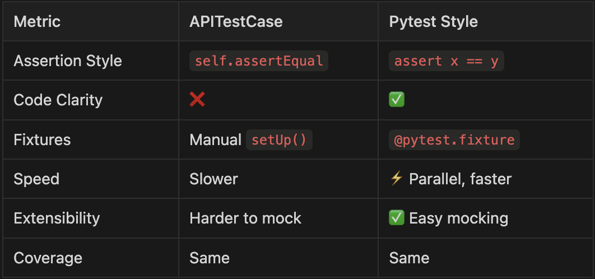

# Django Testing Comparison

This project demonstrates **two testing styles** in Django + DRF:

- Traditional `APITestCase` (class-based)
- Modern `pytest` (function-based, fixture-powered)

## 🔍 Technologies Used
- Django + DRF
- factory_boy
- pytest + pytest-django + pytest-cov
- Test coverage, speed, and structure comparison

## 📦 Run Locally

```bash
git clone https://github.com/Am-Issath/django-testing-comparison.git
```
```bash
cd django-testing-comparison
```
```bash
python -m venv venv && source venv/bin/activate
```
```bash
pip install -r requirements.txt
```
```bash
pytest
```

## 🧪 Test Results

### Run classic test::
```bash
python manage.py test
```

### Run pytest version:
```bash
pytest -v
```

### Run with coverage:
```bash
pytest --cov=books --cov-report=html
```
- Then open htmlcov/index.html.

### Run with speed:
```bash
pytest -n auto
```
---
## Benchmark Results


---

## 🔚 Final Touches

- ✅ Add `.gitignore`
- ✅ Add `requirements.txt`
- ✅ Push to GitHub
- ✅ Optional: Add GitHub Action for `pytest` CI
- ✅ Add star-worthy tags and topics on GitHub

---

## 💥 Want Me to Generate All the Code?

I can generate the entire codebase structure and content for you in one go if you say:

> **"Yes, generate the full project boilerplate for me"**

Otherwise, you can build it step-by-step using this guide — and I’ll be here for code reviews, tweaks, and repo polish.

Let’s ship something 🔥 and useful. Ready to generate?

## ✍️ Author
- **Built with ❤️ by Issath**
> **Backend Engineer · Blogger · Builder**